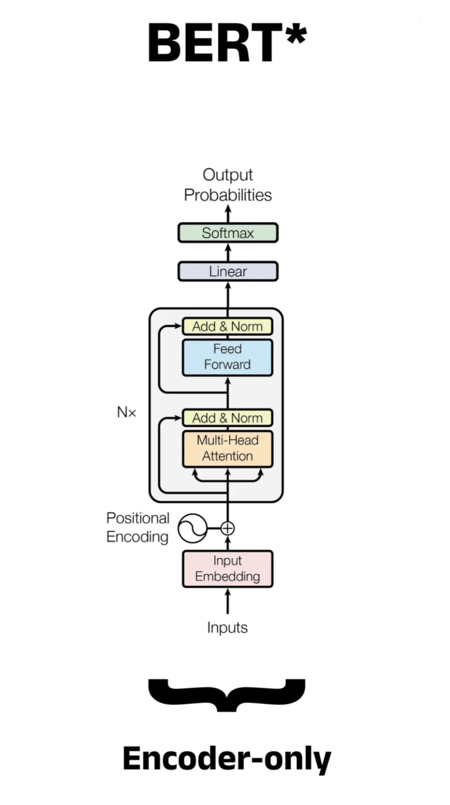

# DistilBERT Book Review Sentiment

## Check out the [Huggingface Model Page](https://huggingface.co/Lkkash/distilbert-book-reviews) for more information about the model.

### Model Sources:
Repository: https://huggingface.co/distilbert/distilbert-base-uncased (Base model)  
Repository: https://huggingface.co/datasets/Lkkash/book-reviews-from-amazon-and-goodreads (For the dataset)

### Description: 
Given the text of a book review, the model predicts whether the review expresses a good/positive or bad/negative sentiment.
This model is intended for sentiment classification of English-language book reviews. Given the text of a book review, the model predicts whether the review expresses a good/positive or bad/negative sentiment. The model can be used for: Classifying individual book reviews by sentiment. Automatically categorizing large collections of book reviews. Exploring sentiment trends in book-review datasets. Educational and research projects involving NLP and text classification. The model is intended primarily for English-language book reviews similar to those in its training data.

Run the model directly from this code: [inference.py](inference.py)

<b> Why did i choose Distilbert-base-uncased for text classification: </b> This is a small, fast, and light Transformer model developed by Hugging Face and one of its
common application is sentiment analysis.

<b> Working: </b> The encoder in DistilBERT works by processing text through 6 layers of multi-head self-attention, which calculates how words relate to each other bidirectionally. It maps input tokens into a geometric vector space, dynamically updating each word's representation based on its surrounding context.

 

  

 

## Fine-tuning

The model was fine-tuned on a dataset containing approximately 107,000 book reviews collected from Amazon and Goodreads. The training data was loaded from books_only_reviews_clean.csv. Only the text and label columns were used for training. The label column was renamed to labels for compatibility with the Hugging Face Trainer. The labels represent binary sentiment: 0 — Bad/negative review 1 — Good/positive review The dataset was divided into training and validation subsets using an 80/20 split with stratified sampling. This resulted in approximately: Training set: 85,600 reviews Validation set: 21,400 reviews Stratified sampling was used to maintain a similar proportion of the two sentiment classes in both subsets. The split used a random seed of 42.    

The model was fine-tuned from [Lkkash/book-reviews-from-amazon-and-goodreads](https://huggingface.co/datasets/Lkkash/book-reviews-from-amazon-and-goodreads ) from [huggingface.co](huggingface.co)  
The source code: for finetuning: [train.py](train.py)

The metrics were as follows:

| Epoch | Validation Loss | Accuracy | F1 Score | Precision | Recall |
|------:|----------------:|---------:|---------:|----------:|-------:|
| 1 | 0.1428 | 95.31% | 95.50% | 96.18% | 94.84% |
| 2 | 0.1741 | 95.53% | 95.76% | 95.39% | 96.13% |

## Evaluation

For the evaluation of the model, [evaluate.py](evaluate.py) can be used to compute the following metrics: 

| Epoch | Validation Loss | 
|:------|:----------------|
| **Accuracy**         | How many predictions were correct overall?                                    |
| **Precision**        | When the model says something is Positive, how often is it actually Positive? |
| **Recall**           | Of all the actual Positive examples, how many did the model find?             |
| **F1**               | A combined measure of precision and recall                                    |
| **Support**          | How many real examples of each class exist                                    |
| **Confusion Matrix** | Shows exactly which classes the model got right and wrong                     |

